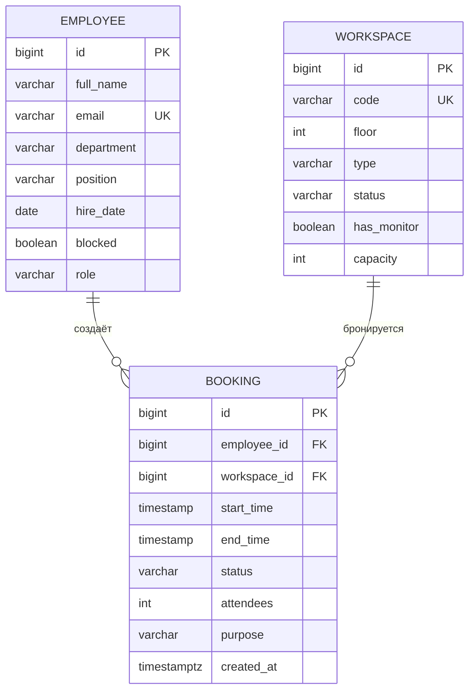

# Система управления офисными местами

Консольное приложение на Java для учёта сотрудников, рабочих мест и бронирований. Данные хранятся
в PostgreSQL, доступ к базе — через чистый JDBC, схема и демо-данные создаются автоматически (Flyway).

Проект — первая из четырёх контрольных работ по одной предметной области:
**КР 1 — консоль (этот проект)** → КР 2 — JavaFX → КР 3 — Spring + REST API → КР 4 — Android.

- **Основная сущность:** бронирование рабочего места
- **Базовый пакет:** `ru.mirea.officebooking`
- **Стек:** Java 21, Maven, PostgreSQL 16, JDBC, Flyway, Apache POI, JUnit 5, Docker

## Содержание

1. [Возможности](#возможности)
2. [Быстрый старт](#быстрый-старт)
3. [Архитектура](#архитектура)
4. [Модель данных](#модель-данных)
5. [Бизнес-правила](#бизнес-правила)
6. [Проверка вводимых данных](#проверка-вводимых-данных)
7. [Обработка ошибок](#обработка-ошибок)
8. [Поиск, фильтры, сортировка, статистика, экспорт](#поиск-фильтры-сортировка-статистика-экспорт)
9. [Тесты](#тесты)
10. [Принятые решения и ограничения](#принятые-решения-и-ограничения)
11. [Что сдаётся](#что-сдаётся)

## Возможности

Главное меню приложения:

```
======================================================
        СИСТЕМА УПРАВЛЕНИЯ ОФИСНЫМИ МЕСТАМИ
======================================================
1. Сотрудники
2. Рабочие места
3. Бронирования
4. Поиск
5. Фильтрация
6. Статистика
7. Экспорт данных
8. Показать таблицы базы данных
0. Выход
```

| Раздел | Что можно делать |
|---|---|
| Сотрудники | список, поиск по id, добавление, изменение, удаление, блокировка / разблокировка |
| Рабочие места | список, поиск по id, добавление (открытый стол, переговорная, телефонная будка), изменение, смена статуса, удаление |
| Бронирования | список, поиск по id, создание, изменение времени / участников / цели, смена статуса (отмена, завершение, неявка), удаление |
| Поиск | по сотруднику (часть ФИО или email), по коду места, по дате |
| Фильтрация | по статусу брони, типу места, этажу, диапазону дат |
| Статистика | сводка по сотрудникам, местам и броням, топы, доля неявок, самый загруженный этаж |
| Экспорт | Excel (`.xlsx`, три листа) и CSV (три файла) в папку `exports/` |
| Таблицы БД | просмотр `employee`, `workspace`, `booking` и служебной `flyway_schema_history` |

Любой список броней можно отсортировать: по началу, по ФИО сотрудника, по коду места, по длительности,
по возрастанию или убыванию.

## Быстрый старт

Нужны JDK 21 и Docker Desktop (для PostgreSQL). Maven ставить не нужно — есть `mvnw`.

### Вариант A — всё в Docker

```
cp .env.example .env          # один раз
docker compose up -d db       # поднять PostgreSQL
docker compose run --rm app   # собрать и запустить консольное приложение
```

Файлы экспорта из контейнера появляются в папке `exports/` проекта.
Остановить БД: `docker compose down` (данные сохраняются в томе `db-data`, снести вместе с данными —
`docker compose down -v`).

### Вариант B — приложение локально, база в Docker

```
cp .env.example .env
docker compose up -d db
./mvnw clean package
java -jar target/office-booking.jar
```

Для разработки удобно поднять БД в Docker и запускать `Main` из IDE.

### Настройки подключения

По умолчанию берутся из `src/main/resources/application.properties`:
`localhost:5434`, база `office_booking`, пользователь и пароль `office`.
Переменные окружения `DB_URL`, `DB_USER`, `DB_PASSWORD` важнее файла (так работает контейнер `app`,
для которого хост базы — `db`). Чтобы сменить порт базы, поменяйте `DB_PORT` в `.env` и `db.url` в
`application.properties`.

Схема и демо-данные (6 сотрудников, 12 мест, 14 броней) применяются автоматически при старте
приложения. Вручную: `./mvnw flyway:migrate`.

Если в консоли Windows русский текст выводится «кракозябрами», запускайте так:
`java -Dstdout.encoding=UTF-8 -jar target/office-booking.jar`.

Если базы нет или неверен пароль, приложение печатает понятное сообщение и завершается с кодом 1.

## Архитектура

Четыре слоя, зависимости направлены только вправо:

```
Console UI  ─►  Service  ─►  Repository (JDBC)  ─►  PostgreSQL
  (ui)         (service)       (repository)
```

- **ui** — меню, ввод и вывод, перехват исключений. Ни SQL, ни бизнес-проверок. Не импортирует
  `repository` и `java.sql`.
- **service** — бизнес-правила, оркестрация репозиториев, поиск / сортировка / статистика на Stream API.
  Не импортирует `java.sql`.
- **repository** — только JDBC: `Connection`, `PreparedStatement`, `ResultSet`, try-with-resources,
  параметризованные запросы. Любой `SQLException` превращается в понятное исключение приложения.
- **model** — сущности, перечисления и доменное поведение. Не зависит от остальных слоёв.

```
src/main/java/ru/mirea/officebooking/
├── Main.java                  сборка объектов вручную, миграции Flyway, запуск меню
├── ui/                        ConsoleApp, ConsoleReader, меню разделов, BookingPrinter
├── service/                   EmployeeService, WorkspaceService, BookingService,
│   │                          StatisticsService, ExportService, DbTablesService
│   └── search/                BookingSearchService, BookingComparators
├── repository/                CrudRepository<T, ID>, Employee/Workspace/Booking/TableDump-репозитории,
│                              SqlExceptionTranslator
├── model/                     Employee, Workspace (abstract) + OpenDesk / MeetingRoom / PhoneBooth,
│                              Booking, 4 enum, Validation
├── exception/                 иерархия исключений приложения
└── util/                      DatabaseManager, Exporter, ExcelExporter, CsvExporter
```

### Где применены принципы ООП

| Принцип | Где |
|---|---|
| Инкапсуляция | поля моделей `private final`, доступ через геттеры, инварианты проверяются в конструкторе |
| Наследование и полиморфизм | `Workspace` и подтипы переопределяют `maxBookingHours()` и `validateBooking()`; `BookingService` не знает конкретного типа места |
| Интерфейсы | `CrudRepository<T, ID>` — единый контракт хранилища; `Exporter` — Excel и CSV подключаются без изменения меню |
| Стратегия | набор `Comparator<Booking>` в `BookingComparators`, меню выбирает нужный |
| Enum с логикой | `BookingStatus` хранит таблицу допустимых переходов (`EnumMap` / `EnumSet`) и метод `canTransitionTo()` |
| Коллекции | `List`, `Map` (`groupingBy` в статистике), `EnumMap`, `EnumSet` |

## Модель данных



Ограничения на уровне БД:

- **PRIMARY KEY** — `id` в каждой таблице, автогенерация (`GENERATED ALWAYS AS IDENTITY`);
- **FOREIGN KEY** — `booking.employee_id` и `booking.workspace_id`, `ON DELETE RESTRICT`;
- **UNIQUE** — `employee.email`, `workspace.code`;
- **CHECK** — значения `role`, `type`, `status`; `hire_date <= CURRENT_DATE`; `floor BETWEEN -2 AND 50`;
  `capacity > 0`; `attendees > 0`; `start_time < end_time`;
- **NOT NULL** — у всех обязательных полей.

Таблицы приведены к третьей нормальной форме: у каждой один простой первичный ключ, неключевые
поля зависят только от него. Подтипы рабочих мест хранятся в одной таблице `workspace` с дискриминатором
`type` (single-table inheritance).

Миграции лежат в `src/main/resources/db/migration/`: `V1__create_schema.sql` (схема) и
`V2__seed_data.sql` (демо-данные). Применённые миграции не редактируются, изменения схемы — новыми файлами `V3`, `V4`…

## Бизнес-правила

Все правила реализованы в слое `service` и работают при любом способе вызова, а не только из меню.

| № | Правило | Исключение |
|---|---|---|
| BR-1 | Место нельзя забронировать на время, пересекающееся с другой активной бронью. Смежные интервалы (конец одной = начало другой) не пересекаются | `BookingConflictException` |
| BR-2 | Сотрудник не может иметь две активные брони на пересекающееся время | `BookingConflictException` |
| BR-3 | Корректность интервала: начало раньше конца, не в прошлом, не дальше 30 дней вперёд, в пределах одних суток и рабочего дня 08:00–22:00, шаг 1 час, длительность не больше предела места | `ValidationException` |
| BR-4 | Сотрудник и место брони должны существовать | `EntityNotFoundException` |
| BR-5 | Место в статусе «на обслуживании» или «выведено из эксплуатации» забронировать нельзя | `WorkspaceUnavailableException` |
| BR-6 | Переходы статуса брони: `ACTIVE` → `CANCELLED` / `COMPLETED` / `NO_SHOW`, из конечных статусов переходов нет | `InvalidStatusTransitionException` |
| BR-7 | Отменить можно только бронь, которая ещё не началась; завершить — только после конца; неявку отметить — только после начала | `InvalidStatusTransitionException` |
| BR-8 | Заблокированный сотрудник не может создавать новые брони | `ValidationException` |
| BR-9 | Переговорная: число участников обязательно и не больше вместимости; для остальных мест участники не указываются | `ValidationException` |
| BR-11 | Нельзя удалить сотрудника или место, на которые есть брони; нельзя перевести место в недоступный статус при активных будущих бронях | `ValidationException` |
| BR-12 | Email сотрудника и код места уникальны (регистр не важен) | `ValidationException` |

Предельная длительность брони зависит от типа места:

| Тип | Предел |
|---|---|
| Открытый стол (`OPEN_DESK`) | 10 часов |
| Переговорная (`MEETING_ROOM`) | 4 часа |
| Телефонная будка (`PHONE_BOOTH`) | 1 час |

Изменить можно только активную бронь, которая ещё не началась.

## Проверка вводимых данных

Проверки выполняются в конструкторах моделей и сервисах. При вводе в меню неверное значение не прерывает
операцию: приложение объясняет ошибку и просит ввести поле заново.

| Поле | Правило |
|---|---|
| ФИО | ровно три слова «Фамилия Имя Отчество»: русские буквы, каждое слово с заглавной, между словами один пробел; допускаются двойные фамилии через дефис; до 150 символов |
| Email | формат `name@domain.ru`, приводится к нижнему регистру, до 150 символов |
| Отдел | не пустой, до 100 символов |
| Должность | необязательная, до 100 символов |
| Дата приёма | существующая дата, не в будущем и не старше 50 лет |
| Код места | формат `A-14`: 1–3 латинские буквы, дефис, 1–3 цифры |
| Этаж | от -2 до 50 |
| Вместимость переговорной | от 1 до 100 |
| Время брони | формат `гггг-мм-дд чч:мм`, только целые часы |
| Цель брони | необязательная, до 255 символов |
| id | положительное целое число |

Даты разбираются строго: несуществующая дата вроде `2026-02-30` отклоняется. В текстовых полях
запрещены управляющие символы. Поисковые запросы экранируют `%` и `_`, поэтому они ищутся как обычные символы.

## Обработка ошибок

Все исключения приложения — непроверяемые и наследуются от `AppException`:

```
RuntimeException
└── AppException
    ├── EntityNotFoundException              запись не найдена по id
    ├── DatabaseException                    сбой подключения или SQL
    ├── ExportException                      сбой записи файла экспорта
    └── BusinessRuleException (abstract)
        ├── BookingConflictException         BR-1, BR-2
        ├── InvalidStatusTransitionException BR-6, BR-7
        ├── WorkspaceUnavailableException    BR-5
        └── ValidationException              BR-3, BR-8, BR-9, BR-11, BR-12 и проверка данных
```

| Ситуация | Что происходит |
|---|---|
| Текст вместо числа, неверная дата | сообщение и повторный запрос ввода |
| Запись не найдена | сообщение «Запись «Сотрудник» с id=7 не найдена», возврат в меню |
| Нарушено бизнес-правило | сообщение с причиной (например, какая именно бронь занимает место), возврат в меню |
| Ошибка SQL | `SQLException` переводится по коду: дубликат, внешний ключ, `NOT NULL`, `CHECK`, потеря соединения |
| База недоступна при запуске | сообщение и выход с кодом 1 |
| Закрыт ввод (Ctrl+Z / Ctrl+D) | приложение завершается без зацикливания |
| Непредвиденная ошибка | сообщение с типом ошибки, приложение продолжает работать |

## Поиск, фильтры, сортировка, статистика, экспорт

**Поиск** (результат — брони): по части ФИО или email сотрудника, по части кода места, по дате
(все брони, пересекающие этот день).

**Фильтры:** по статусу брони, по типу места, по этажу, по диапазону дат.

**Сортировка** применяется к любому списку броней (`Comparator` + Stream API).

**Статистика:**

- всего сотрудников и сколько из них заблокировано;
- места по типам и по статусам;
- брони по статусам;
- средняя длительность завершённой брони;
- доля неявок: `NO_SHOW / (COMPLETED + NO_SHOW)`;
- топ-5 самых бронируемых мест и топ-5 самых активных сотрудников;
- самый загруженный этаж.

**Экспорт** в папку `exports/`:

- Excel — файл `office-booking-<гггггммдд-ччмм>.xlsx` с листами `Employees`, `Workspaces`, `Bookings`,
  заголовки жирным, закреплённая первая строка, автоширина колонок;
- CSV — три файла (`employees.csv`, `workspaces.csv`, `bookings.csv`) в отдельной папке, разделитель `;`,
  кодировка UTF-8 с BOM (корректно открывается в Excel); значения, начинающиеся с `=`, `+`, `-`, `@`,
  экранируются от формульных инъекций.

## Тесты

```
./mvnw test
```

74 теста, база данных не нужна:

- проверка моделей: формат ФИО, email, даты, код места, вместимость, пересечение интервалов,
  переходы статусов;
- `BookingService` на подставных репозиториях и фиксированных часах: все правила BR-1…BR-9, граничные
  случаи (смежные интервалы, ровно 30 дней вперёд, начало и конец рабочего дня);
- перевод ошибок БД в понятные исключения.

Интерактивные сценарии (меню, экспорт, ошибки запуска) дополнительно проверены вручную на PostgreSQL.

## Принятые решения и ограничения

- **Гранулярность брони — час.** Бронь — полуоткрытый интервал `[начало; конец)`.
- **Полиморфизм через абстрактный `Workspace`.** Подтип задаёт предел длительности и правила проверки брони.
- **Вместимость.** В таблице `workspace` колонка `capacity` обязательна, для столов и будок хранится `1`.
- **Соединения.** Открываются на каждую операцию и закрываются через try-with-resources, пул не используется.
- **Параллельная работа.** Приложение рассчитано на одного пользователя. Для нескольких одновременных
  клиентов нужны транзакции и ограничение `EXCLUDE` на пересечение интервалов в БД.
- **Права.** Понятия «текущий пользователь» и проверки прав на отмену чужой брони нет.

## Что сдаётся

- [x] Исходный код Java-проекта и `pom.xml`
- [x] SQL-скрипты создания БД (Flyway-миграции `src/main/resources/db/migration/`)
- [x] Экспортированный Excel-файл (`exports/`)
- [x] Инструкция по запуску (этот файл)
- [x] Рабочее консольное приложение
- [ ] ER-диаграмма в PNG (диаграмму можно получить из IntelliJ IDEA / DataGrip: правой кнопкой по схеме
  `public` → Diagrams → Show Visualization → Export)
